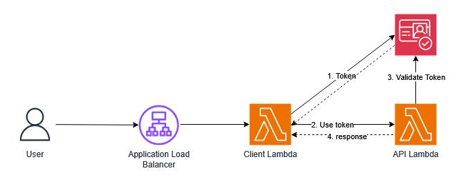
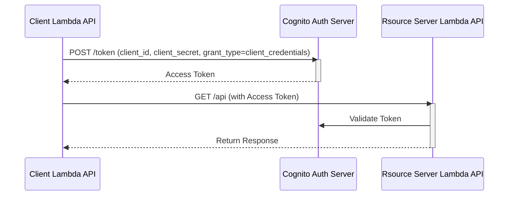
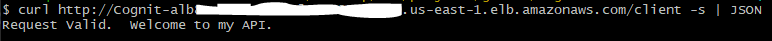

# Use Amazon Cognito for OAUTH 2 Client Credentials
In this example, we use [Amazon Cognito](https://aws.amazon.com/cognito/) to securely communicate between System-To-System.

This application uses OAUTH 2 [Client Credentials Grants](https://datatracker.ietf.org/doc/html/rfc6749#section-4.4) configured using Amazon Cognito User Pool.

## Architecture

## Client Credential Grant Flow

## What does this build?
* Creates AWS Cognito UserPool and UserPool Client 
* Uses Amazon Cognito as the Authorization Server
* Creates an API lambda that performs the Resource Server functionality AKA API.
* Creates another lambda that performs the Client workflow
* Creates Application Load Balancer endpoints for the lambdas

> *Note: This example uses both Resource Server and Client workflows in one.  It also registers a client automatically.*

## Steps to run and test
* Run the CDK code and wait for it to finish.  It will print out the API endpoints.
    * Execute the Client API endpoint
    * 

## Considerations
There are many opportunities for improve this solution such as but not limited to:
* Use other Authentication flows
* Treat ClientID as a secret and store in SSM Parameter Store
* [Securely Share the Secrets with your clients](https://github.com/smislam/securely-share-secrets)

## References
* [OAuth 2.0 Authorization Framework](https://datatracker.ietf.org/doc/html/rfc6749)
* [Amazon Cognito](https://aws.amazon.com/cognito/)
* [Amazon Secrets Manager](https://aws.amazon.com/secrets-manager/)
* [Amazon Lambda](https://aws.amazon.com/lambda/)
* [Amazon API Gateway](https://aws.amazon.com/api-gateway/)